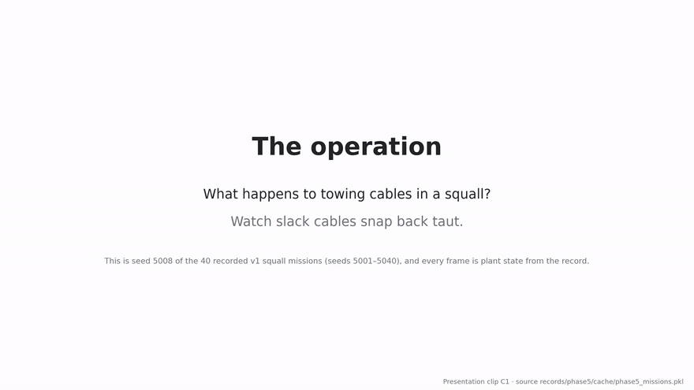
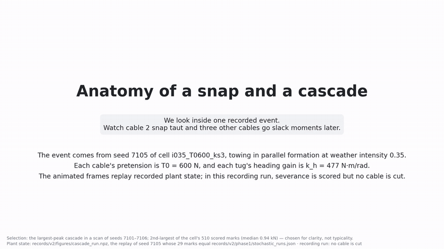
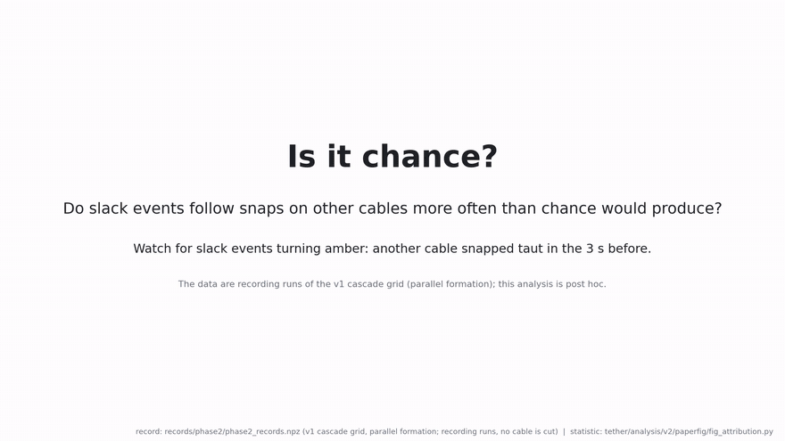
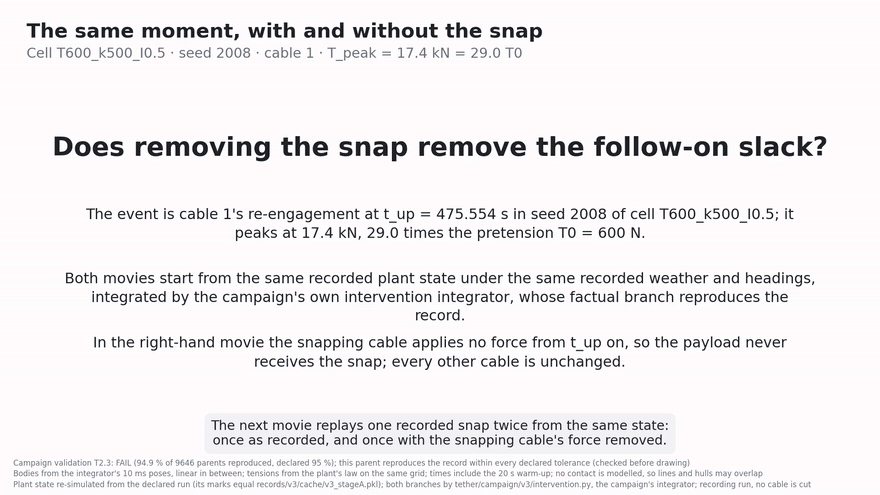
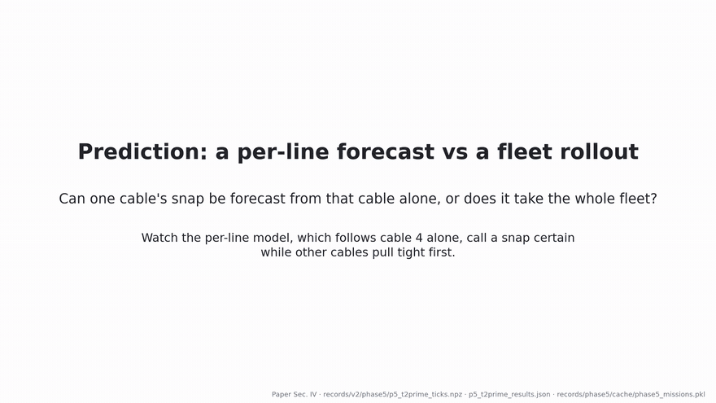
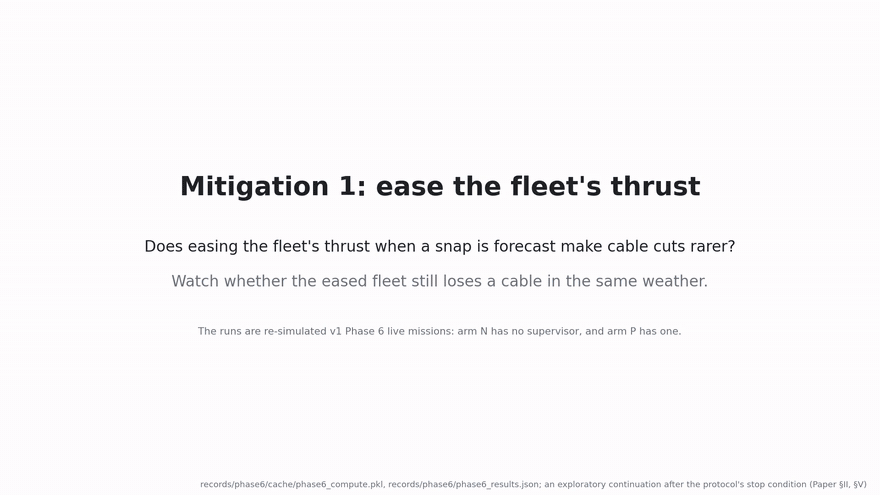
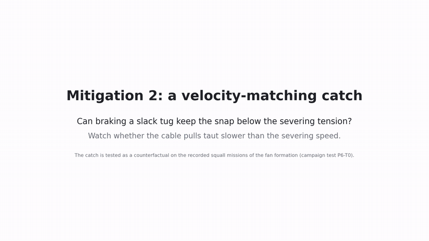
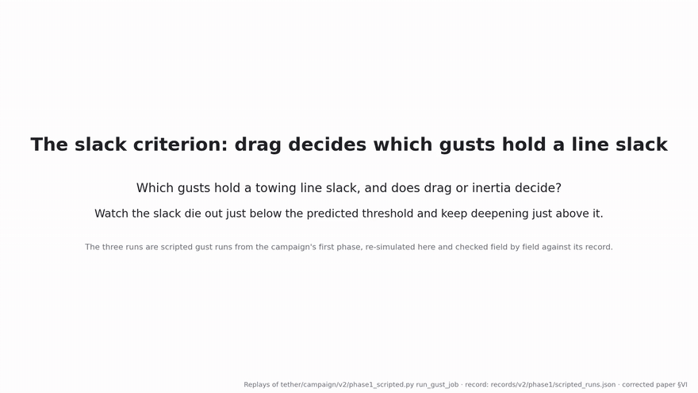

# Threshold: snap loads, slack, and severance in cable-towed fleets

Simulation code and manuscripts for a research programme on fleets of vessels (or robots) that tow one
payload through unilateral cables. A cable that goes slack and is pulled taut again produces a *snap*;
because the cables share the payload, a snap on one cable changes the tension in every other cable. The
programme studies how large that coupling is, whether it lets slack and severance spread, and what
monitoring and control can do about it.

The manuscript in this repository is the IEEE ACC 2027 paper **Snap-Load Transmission Between Cables
Sharing a Towed Payload: Why the Impulsive Estimate Overpredicts** ([`IEEE_ACC_2027/`](IEEE_ACC_2027/),
8 pages, built with `make acc-paper`). The code also supports a companion journal manuscript, **Cable
Severance in Cooperative Towing is a Fleet Problem: Limits of Per-Line Prediction and of Thrust-Based
Mitigation**, whose sources are not included; its presentation segments are.

**In this repository:** the `tether` Python package, which implements a planar Drake multibody model of
five tugs and a pentagonal payload joined by unilateral Kelvin–Voigt cables, sensor-driven heading
control and autoregressive weather; event extraction; the drivers of three campaign programmes with
hashed pre-registration; a Drake-free theory layer (linear response of the closed-loop tow, snap
transmission, branching, excursion laws); estimation, monitoring and extreme-value statistics; and the
report, figure and presentation generators. Also the ACC manuscript with its figures, the journal
paper's presentation segments, the tests, and the development environment.

**Not in this repository:** the campaign outputs (every recorded run, reduction and scored result), the
campaign plans, the analysis sources of the ACC paper (the numerical evaluation of the collinear model,
the ACC figure scripts and the drivers of its three declared follow-up tests), and the journal
manuscript. The ACC manuscript includes the figures and numbers these produced. No hardware or field
data, three-dimensional or distributed cable model, or hull contact is implemented.

---

## Research contributions

### ACC 2027: cross-cable snap transmission

- **Prior approach.** Treat a cable's re-engagement as an instantaneous impulse on the payload and hold
  the neighbors' far ends fixed (the rigid-impact, or impulsive, estimate). For the testbed this predicts
  that a neighbor loses 0.44 of the snap's peak tension, so a snap of about 2.3 times the pretension
  would unload a neighbor.
- **Proposed approach.** Keep the finite contact duration and the recoil of the neighbors' far ends.
  For a collinear tow the paper proves a similarity law (the transmitted fraction is independent of
  closing speed and, without dissipation, of stiffness), an exact unloading criterion, and a closed form
  under a half-sine contact pulse through its shock spectrum; with free far ends the impulsive regime is
  unreachable for identical vehicles, and the transmission is at least 21% below the corresponding
  impulsive value for up to ten cables.
- **What is new.** The cross-cable transmission ratio as the quantity of interest, the structural
  incompatibility of the impulsive estimate's two assumptions, and a pre-registered test of the
  resulting forecast (0.165) on a nonlinear planar fleet.
- **What this repository implements.** The planar plant, the committed planar forecast
  ([`tether/theory/transmission.py`](tether/theory/transmission.py)), and the pre-registered campaign
  that tested it ([`tether/campaign/v3/`](tether/campaign/v3/)), including the post hoc counterfactual
  estimator. The collinear theory is derived in the manuscript (Secs. III–IV).

### Companion journal manuscript: severance as a fleet problem

- **Prior approach.** Offshore practice treats snap loads one line at a time (snap tension = line
  impedance × closing speed), with per-line slack criteria, monitoring and rate laws.
- **Finding.** When lines share a payload, per-line reasoning fails: a quarter to two-thirds of slack
  events follow a re-engagement on a different cable within three seconds; a per-line first-passage
  hazard is structurally miscalibrated (recalibration slope 0.50) while a six-body fleet rollout ranks
  events near-perfectly; easing fleet thrust and a velocity-matching catch both fail their tests; a
  drag-conjugate slack criterion predicts the pooled crossing to 1.1%. The extension measures the
  transmission by intervention (Sec. III-D) and describes the cascade as a process (Sec. IV).
- **What this repository implements.** The drivers of the v1 phases 0–6, plan v2 and plan v3
  ([`tether/campaign/`](tether/campaign/)), the monitors and mitigation laws they test, and the figure
  generators in [`tether/analysis/v2/paperfig/`](tether/analysis/v2/paperfig/) and
  [`tether/analysis/v3/paperfig/`](tether/analysis/v3/paperfig/).

---

## The simulations, in motion

The nine simulation clips of the journal manuscript's presentation, in the order the presentation
plays them. Every frame is plant state: a recorded campaign run, or a replay of one that asserts in
code, before drawing a frame, that it reproduces the recorded run (configuration hash, re-engagement
marks, peak tensions). The animations below are GIF renderings (880 px wide, 10 frames per second,
full length); the full-resolution videos (1920 × 1080, 30 fps) are in
[`Presentation/`](Presentation/), one `<name>.mp4` per clip. Each clip's selection and caveats are
stated below it.

Conventions used in every clip: a taut cable is drawn solid with width proportional to its tension,
a cable that carries no tension is dashed red, the payload is the plant's pentagon and the tugs its
3 m hulls, to scale. *T0* is the pretension (the steady towing pull), a *snap* is the tension pulse of
a slack cable pulled taut again (a *re-engagement*), and in *recording* runs severance is scored at a
4.5 kN stress threshold without cutting any cable. The first eight clips predate the plan v3
extension; the ninth, `intervention`, belongs to it.

### 1. The operation: one squall-passage mission (`setting`, 70 s)



One recorded v1 Squall Passage mission (seed 5008): five tugs in fan formation tow one payload on five
unilateral 12 m cables at T0 = 1 kN, under a scheduled thrust ramp, a commanded 60° dogleg to port
(40–70 s), a squall from port (50–70 s), deceleration (110–130 s) and random background weather. The
mission plays at four times real speed in a top-down view beside the payload's track, the five cable
tensions, a ticker of recorded re-engagements, the mission schedule, and a running maximum-tension
strip against the 4.5 kN scored level. Cable 4 snaps taut at 13.4 kN at 58.8 s. In the squall the
payload swings about 120° to starboard, not to port, drifts 89 m downwind, and the tugs' fan collapses
for the rest of the mission. All five cables are slack from 71 s and snap back at 76.1–77.3 s, peaking
at 17.0 kN. The playback pauses at three named instants: the first snap above 4.5 kN, the payload's
heading extreme in the squall (62.85 s), and the mission's maximum (76.15 s). The closing captions
state the study's question: per-line practice predicts a snap's peak from the line's closing speed
(how fast its ends move apart as it comes taut), but does that speed still belong to one line when
lines share one payload?

*Selection:* the mission of the prediction clip (the seed holding the most per-line false alarms on
coupled ticks at 70–110 s, 6 of 18); not typical, since its 16.96 kN maximum is the 6th largest of
the 40 missions (median 4.24 kN). *Caveats:* the plant models no hull contact, and from 62 s two tug
centres come within 1 m, so their hulls overlap; the v1 Phase 5 missions ran in the exploratory
continuation after the protocol's stop condition.

### 2. Anatomy of a snap and a cascade (`snap_cascade`, 106 s)



One recorded cascade from the inside: seed 7105 of the parallel-formation cell at T0 = 0.6 kN and
weather intensity 0.35. Cable 2 has been slack since 82.2 s because its chord (the distance between
its ends) is shorter than its 12 m rest length. After a 6 s real-time approach the clip slows to one
twentieth of real speed: cable 2 re-engages at t0 = 91.486 s with its chord lengthening at 1.78 m/s
and peaks 66 ms later at 13.5 kN, 22.5 times T0, while cables 0, 3 and 4 carry no tension. The bottom
panel shows cables 0, 4 and 3 going slack 30, 52 and 70 ms after t0; cables 3 and 4 then re-engage in
turn with smaller peaks of 3.5 and 2.8 kN. A slide then gives the journal's derivation as it stood at
the time: treating the snap as an impulse on the shared payload, the other cables' tension swings by
up to about 0.44 of the peak (less for cables at an angle to the snapping one), so a peak above about
2.3 T0 could unload a neighbour. The clip states that this gain is derived, never measured (declared band 0.2–0.9), and that
one event cannot measure it; the campaign measured its consequence instead (the next clip). It closes
on the point that a snap on one cable can unload the others, which a one-cable model cannot represent.

*Selection:* the largest-peak cascade in a scan of seeds 7101–7106, the 2nd-largest of the cell's 510
scored re-engagements (median 0.94 kN), chosen for clarity. *Status:* the plan v3 campaign later
measured the transmission (0.148 by counterfactual re-integration against a committed forecast of
0.165), which puts the unloading threshold near 6–7 T0 rather than 2.3 T0; the ACC 2027 paper derives
why the impulsive estimate of 0.44 overpredicts.

### 3. Is it chance? Cascades against a time-shift baseline (`cascade_statistics`, 64 s)



One mission of the v1 cascade grid (T0 = 0.6 kN, heading gain 250, intensity 0.5, seed 2010) as a
timeline of slack spells (red) and re-engagements (blue ticks). A slack event turns amber when another
cable re-engaged in the preceding 3 s; going slack again within 2 s on the same cable counts as a
bounce. In the mission's busiest 90 s (395–485 s), 16 of 21 slack events follow another cable's
re-engagement; over the whole mission, 32 of 52. For a chance baseline, the whole train of
re-engagements slides in time, which keeps both rates but destroys causal timing: the shift shown
(231.5 s) lowers the mission's amber share from 62% to 15%, and its 200 shifts average 18%. The chart
then shows all 18 scored cells: in every one the measured share (26–68%) exceeds the baseline's
97.5th percentile, from 1.4 times the chance mean in the densest cell (where chance alone gives 49%)
to 21 times.

*Selection:* the median cell by measured share, its seed with the most events, and its densest 90 s
window, chosen for clarity (the mission's 61.5% exceeds its cell's 44.9%). *Caveats:* the statistic and
its baseline are post hoc; the shift also removes co-timing from shared weather, so the excess bounds
the cable-to-cable effect rather than isolating it.

### 4. The same moment, with and without the snap (`intervention`, 103 s; plan v3)



One recorded snap replayed twice from the same plant state (calibration cell T0 = 0.6 kN, heading gain
500, intensity 0.5; seed 2008): on the left as recorded, on the right with the snapping cable applying
no force from its re-engagement on. At one tenth of real speed, cable 1 re-engages at
t_up = 475.554 s and peaks at 17.4 kN, 29.0 times T0; on the right the payload never receives that
pull. Tension traces under each panel mark every moment another cable goes slack. The replay then runs
in real time to t_up + 3 s, the window in which the campaign attributes slack onsets to a snap: 14
onsets on the other cables follow the recorded snap and none occurs without it, so the replay credits
this snap with 14 onsets. The second segment explains how such counts, collected over many snaps,
form a branching matrix whose spectral radius ρ says whether cascades die out (ρ < 1) or grow, and
plots ρ along the weather-intensity sweep. Each ρ is fitted on one cell's two fitting runs, so the
zigzag across intensity is a two-run artefact; at intensity 0.5, the harshest the formation survives,
ρ = 0.94 is a point estimate without an interval.

*Selection:* of 873 sampled parent snaps in the cell, the one with the largest causal count, chosen
for clarity. *Caveats:* the counterfactual holds the snapping vessel's heading at its re-engagement
value and keeps every other input as recorded; the re-integrator's pre-registered validation (T2.3)
failed narrowly (94.9% of 9646 parents reproduced against the declared 95%), so counterfactual counts
are reported as untrusted.

### 5. Prediction: a per-line forecast against a fleet rollout (`prediction`, 146 s)



The mission of clip 1 (seed 5008), from 71 s, when all five cables go slack one second after the
squall ends. Every 0.1 s two models forecast h, the probability of a dangerous snap of cable 4 within
1 s (dangerous: pulling tight faster than the severing speed v_b = 0.47 m/s, at which its estimated
peak reaches 4.5 kN). Both receive the exact plant state; the per-line first-passage model (red)
looks at cable 4 alone, while the six-body fleet rollout (blue) simulates every body and is also given
the known forcing. From 75.6 to 76.1 s cable 4's gap closes at 2.0–3.3 m/s and the per-line model
forecasts h = 1.00, a certain dangerous snap; from the same state the rollout forecasts h = 0.00 at all
six ticks. At 76.11 s cables 1 and 2 re-engage first (17.0 and 16.6 kN); post hoc, the payload is
jerked toward vessel 4 and cable 4's closing speed falls from 3.3 to 1.4 m/s. Cable 4 re-engages only
at 77.29 s, at 1.96 m/s: the six certain forecasts were false alarms, and the per-line model then
forecast h = 0 at four ticks whose next second did hold that snap, while the rollout stayed within
0.002 of the truth. Over all 40 missions and 9227 scored ticks, the per-line model issued 439
forecasts of 0.9 or more, 25 of them false alarms, and 24 of those 25 fell on coupled ticks (another
cable re-engaged within 1 s); the rollout was wrong on none of its 471. The per-line model is not noisy
but incomplete.

*Selection:* the mission holding the most coupled per-line false alarms at 70–110 s (6 of 18); the
extreme case, not a typical one. *Caveats:* both models had the exact state and the rollout also the
known forcing, so neither is a deployable monitor; the rollout fails its own pre-declared calibration
slope gate by near-separation.

### 6. Mitigation 1: ease the fleet's thrust (`easing`, 149 s)



Live v1 Phase 6 missions, in which the simulator cuts any cable whose tension reaches the 4.5 kN
stress threshold, shown in pairs with the same seed and weather: arm N (left) has no supervisor; in
arm P (right) a supervisor eases each vessel's thrust by up to 60% on the largest hazard that vessel
has heard across the fleet (0.4 s per hop on the communication ring), with every vessel forecasting
from the proposed estimator, which fuses its neighbours' delayed estimates of the payload. Seed 6001:
both arms lose cable 3 as it snaps taut (N at 57.930 s, P at 58.273 s). Seed 6009, the first where only
N loses a cable (58.221 s): P's run had already stopped at 58.037 s when cable 4's two ends came within
1 m, a formation closure scored as no severance. Seed 6023, the first where only P loses a cable:
eased, P loses cable 3 at 53.365 s, while N never loses one. Over 60 paired seeds each arm loses a
cable in 25 missions (0.417); the paired difference is 0.00 (95% interval −0.067 to 0.067), with two
discordant seeds each way, and both seeds where only N severs are formation closures in P. Fed by the
true state the same supervisor gives 0.400, fed by a local monitor 0.550; fed by the proposed
estimator its only statistically resolved effects are costs (0.52 m more docking error, 0.2% more
mission time). Easing the fleet's thrust left severance unchanged.

*Selection:* the first seed of each kind of paired outcome, not typical. *Caveats:* the 4.5 kN threshold
is the campaign's stress threshold, not a certified break force; the campaign ran after the
pre-registered protocol's stop condition, so it is exploratory.

### 7. Mitigation 2: the velocity-matching catch (`catch`, 118 s)



The catch lowers a slack vessel's thrust while the slack closes faster than a landing profile, a
reference speed that tapers to a soft landing at contact. It is evaluated as a counterfactual: from
the recorded turnaround of a dangerous excursion (where the slack is deepest) the whole fleet is re-run
with the recorded thrust and with two catch variants, thrust-hold (may cut thrust to zero) and
thrust-reverse (may also reverse it, down to full astern), both fed the true chord state at 10 Hz.
Seed 5020, cable 4, the typical failure: all three runs pull the cable taut above the severing speed
v_b (3.50, 2.58 and 2.45 v_b), and although braking lowered the closing speed, the tension peak rose
from 8.6 to 10.4 and 9.9 kN. Seed 5028, cable 0, the one excursion the catch saves: it never commands
less than 795 N, so both variants run identically; braking delays the snap by 1.2 s and brings the
cable taut at 0.89 v_b, against 1.94 v_b with the recorded thrust. Over all 16 first-severance
excursions the catch lowers the median closing speed from 4.39 v_b to 2.86 (thrust-hold) and 2.59
(thrust-reverse), yet both variants save only 1 of the 16 against a pre-declared bar of 0.80. Why it
fails is not established; post hoc, thrust-reverse reaches full astern only on its six fastest
closers.

*Selection:* the lower-median excursion by closing speed, and the only excursion caught. *Caveats:* the
re-runs use the campaign's counterfactual integrator, not a Drake re-simulation; headings are
prescribed from the record; the law was given the true state, so this tests the law, not an
estimator.

### 8. The slack criterion: drag decides which gusts hold a line slack (`slack_criterion`, 69 s)



Three replayed scripted gusts on vessel 2 of the parallel fleet (T0 = 1 kN, a 10 s square gust, no
background weather). The gust's drag-conjugate load W^c is the drift-speed difference it causes
between vessel 2 and the payload, times drag; its size λ = W^c / T0, and the theory predicts slack
that keeps deepening above λ = 1. At λ = 0.9 the slack stays under 1 cm and soon ends; at λ = 1.05 it
keeps deepening while the gust acts, and after the gust the line snaps taut at 1.78 m/s with a 14.9 kN
peak; at λ = 1.5 cable 2's two ends come within 1 m and this formation closure ends the run. The
closing chart scores every run on the sustained drift over the gust's last 2 s, not at onset: the
fitted lines cross zero at λ = 0.989 on average, against the predicted 1.000, while an inertial
criterion based on the acceleration at onset had predicted 1.055 or 1.077. Drag, not inertia, decides
which gusts hold a line slack; the criterion involves one cable only, so per-line practice can adopt
it unchanged.

*Selection:* the sweep's grid values either side of the predicted crossing, and one well above it.
*Caveats:* deterministic scripted runs with the gust on one vessel only; the recorded 1 kN fit keeps
one run that the declared censoring rule excludes, and without it the pooled crossing is 0.987, still
inside the declared 5% band.

### 9. Pretension: one knob, two requirements (`pretension`, 81 s)


Seed 7105 in two cells side by side with the same weather: T0 = 0.6 kN (left) and 1.0 kN (right),
with the heading gain raised by the declared schedule. On the left cable 2 goes slack at 82.2 s and
re-engages at 13.5 kN, and within 70 ms three other cables go slack (the cascade of clip 2); on the
right no cable goes slack at any time in the run, so nothing snaps. A strip tracks the chord-angle
spread, how widely the cable directions wander: more pretension and heading gain keep it smaller, yet
both runs miss the 15° shape band (whole-run spreads 38.1° and 23.5°). Over 20 runs at each
pretension, raising it narrows the spread from 35.9° to 20.9° and cuts re-engagements from 510 to 4
(−99.2%). None of the grid's eight settings meets the band, and the closest to both requirements
misses it by a factor of 2.39: more pretension steadies the shape but suppresses the slack events a
design law needs, so no setting on the grid gives both.

*Caveats:* the two cells differ in pretension and in heading gain, so the comparison is not pretension
alone; one seed's whole-run spreads differ from the cell statistics.

---

## Repository map

| Path | Contents |
|---|---|
| [`tether/`](tether/) | The Python package (see the next table) and its tests, `tether/tests/`. |
| [`IEEE_ACC_2027/`](IEEE_ACC_2027/) | The ACC 2027 manuscript: LaTeX sources, the seven figures, the conference class and bibliography style, the compiled PDF. |
| [`Presentation/`](Presentation/) | The journal paper's nine simulation clips (`<name>.mp4`) and their GIF renderings (`gifs/<name>.gif`). |
| [`Makefile`](Makefile) | Entry points for the v1 and v2 campaigns, the v1 figures and replays, the ACC manuscript, and the tests. |
| `DevContainers/` | Git submodule with the development container (branch `Drake`), defined in `DevContainers/.devcontainer/`. |
| [`pytest.ini`](pytest.ini), [`requirements.lock.txt`](requirements.lock.txt) | Test configuration; pinned Python package versions (checked by the Phase 0 acceptance test). |
| [`LICENSE`](LICENSE) | License. |

### The `tether` package

| Subpackage | Contents |
|---|---|
| [`physics`](tether/physics/) | Plant constants (`constants.py`); the production Drake plant (`fleet.py`: pentagonal payload, five vessels on planar joints, 0.5 ms SAP step, unilateral cable bank with 1 ms re-engagement tracking, hull forces); cable event tracking (`cable.py`, `events.py`); AR(1) weather with 8 s memory (`weather.py`); noisy sensors (`sensors.py`); earlier Phase 0/1 plants (`plant.py`, `phase1_*.py`). |
| [`control`](tether/control/) | 50 Hz heading controller with cable-bearing trim (`controller.py`); the Phase 6 hazard supervisor (`supervisor.py`); the v2 velocity-matching catch (`catch.py`). |
| [`estimation`](tether/estimation/) | Per-vessel invariant SE(2) EKF (`core.py`), fusion over a delayed network (`fusion.py`, `comms.py`), Drake adapters, replay and NEES calibration, truth-isolation lints. |
| [`theory`](tether/theory/) | Drake-free: closed-loop linearization (`reduced_lti.py`), snap transmission and the committed forecast (`transmission.py`), branching (`branching.py`), excursion and slack laws (`excursion.py`, `drag_excursion.py`, `impact.py`, `gust.py`). |
| [`monitor`](tether/monitor/) | Per-line hazard (`hazard.py`, `linearized.py`), six-body fleet rollout (`fleet_rollout.py`), outcome labels and calibration metrics. |
| [`evt`](tether/evt/) | Bootstrap, calibration, extremal index, tail fitting, dependence, Poisson and proportion intervals. |
| [`campaign`](tether/campaign/) | One closed-loop run (`fleet_run.py`: `FleetRunSpec`, `build_run`, `run_to_end`); deterministic serialization and process pool (`common.py`); v1 drivers `phase0.py` … `phase6.py`; plan v2 (`v2/`); plan v3 (`v3/`: cells and seeds, declaration and addenda, compute, in-worker reduction, counterfactual re-integration, scoring of WP1–WP3, post hoc sensitivities). |
| [`analysis`](tether/analysis/) | Phase reports and figures; journal figures (`v2/paperfig/`, `v3/paperfig/`); presentation clips and slides (`v2/present/`, `v3/present/`); v3 report, evidence table, explorer and pre-registration appendix (`v3/`). |
| [`tests`](tether/tests/) | Plant and Phase 0/1 acceptance, theory, statistics, estimation and monitoring, campaign machinery including the v3 pre-registration workflow, and the ACC paper's planar forecast. |

Module docstrings describe each module's role; the larger modules also state inputs, outputs and algorithm.

---

## Quick start

All commands run from the repository root; the Makefile sets `PYTHONPATH`.

**Environment.** Initialize the submodule first (`git submodule update --init`; its URL uses SSH). Then
open the repository in the development container of `DevContainers/` (Ubuntu 22.04, Python 3.10.12,
Drake 1.51.1; the container requires an NVIDIA GPU), or:

```bash
python3.10 -m venv .venv && . .venv/bin/activate
pip install -r requirements.lock.txt
```

**Manuscript.**

```bash
make acc-paper         # IEEE_ACC_2027/main.pdf (latexmk)
```

**Tests.**

```bash
make test-fast     # plant, theory, statistics, v3 and ACC tests (under a minute)
make test          # all tests; the legacy Phase 1 tests build large fixtures and take long
```

In a checkout of this repository `make test-fast` gives 206 passed and 9 skipped, and `make test`
510 passed and 16 skipped (about 9 minutes). Tests that compare with campaign outputs skip when those
outputs are absent, and a few long simulation tests run only with `TETHER_SLOW=1`.

**Campaigns.** The v1 phases (`make phase0` … `make phase6`, and the Phase 1 stage drivers) and plan v2
(`make v2`, or its steps `make v2-phase0`, `v2-sway`, `v2-claim-a`, `v2-phase1`, `v2-p5-pretest`) run
from scratch. A driver writes its outputs locally and later stages read them, so the programmes run in
order (the v2 pre-test P5-T2′ reads the v1 Phase 5 missions). Once the v1 phases have run,
`make figs` redraws their figures and `make replay` re-simulates each phase's probe run and checks it
against the output.

Plan v3 (`tether/campaign/v3/`), the v2 pre-test P6-T0 (`tether/campaign/v2/p6_t0.py`), the journal
figures (`tether/analysis/v2/paperfig/`, `tether/analysis/v3/paperfig/`) and the presentation
generators (`tether/analysis/v2/present/`, `tether/analysis/v3/present/`) have no Makefile target:
their declarations hash campaign plans that are not included, or they read the journal manuscript or
v3 outputs. The presentation generators write to `Presentation/clips/`, `Presentation/manifests/` and
`Presentation/cache/`, which are not included.

---

## Reproducibility summary

| Item | Value |
|---|---|
| OS | Ubuntu 22.04 (development container; base image `nvidia/cuda:12.4.1-devel-ubuntu22.04`) |
| Python and packages | Python 3.10.12; drake 1.51.1, numpy 2.2.6, scipy 1.15.3, matplotlib 3.10.9, pytest 8.4.2 |
| GPU | Not used by the code; the development container requires an NVIDIA GPU (it runs with `--gpus=all` and checks CUDA on creation); without one, use the virtual environment |
| External tools | `pdflatex`, `bibtex`, `latexmk`; `ffmpeg`/`ffprobe` for the presentation; `git` (outputs embed the source revision) |
| Environment variables | `PYTHONPATH` (set by the Makefile), `TETHER_WORKERS` (pool size, default 16; the Makefile variable `WORKERS` passes `--workers`), `TETHER_SLOW=1` (slow tests), `TETHER_DEV_DIR` (clip preview stills), `SLIDES_DRY` (slide layout check without encoding) |
| Seeds | Declared per campaign (v3: pilots 2001–2002, scored 2003–2022, defined in `tether/campaign/phase2.py` and reused by `tether/campaign/v3/cells.py`); weather `SeedSequence([seed, 11, body])`; bootstrap generators seeded in each analysis module |
| Determinism | Campaign outputs are written byte-deterministically (`tether/campaign/common.py`); a re-simulated run reproduces its recorded re-engagement marks bit for bit with the pinned versions |
| Compute | v1 Phase 2: 40.3 core-hours; v3 stage A: 29.3; v3 stage B: 5.5; v3 WP1 sensitivity: 8.1 |

---

## Where the Novel Contribution Is Implemented

### ACC 2027 paper

```text
Novel contribution: finite-contact, free-end snap transmission (collinear theory)
    └── IEEE_ACC_2027/Sec_03_model.tex, Sec_04_theory.tex
            Prop. 1 (similarity), Cor. 1 (unloading criterion), Lemma 1 (shock spectrum),
            Thm. 1 (closed form), Cor. 2 (free far ends); Table I, Figs. 2-3, and the model
            curves of Fig. 6 in Sec. V-C (numerical evaluation not included in this repository)

Novel contribution: the committed planar forecast R_ij and its normalizer g_ij
    ├── tether/theory/transmission.py     closed_form_ratio() (Eq. 3), frequencies(),
    │                                     closed_form_operator(), predicted_pair_table()
    └── tether/theory/reduced_lti.py      34-state translation-invariant linearization of the closed loop

Supporting implementation (standard infrastructure)
    ├── tether/physics/fleet.py, cable.py, weather.py, sensors.py   Drake plant, event tracking, weather
    ├── tether/control/controller.py                                 heading loop with cable-bearing trim
    ├── tether/campaign/fleet_run.py                                 FleetRunSpec, closed-loop runs
    └── tether/campaign/common.py                                    deterministic outputs, process pool

Adaptations of existing methods
    ├── Delassus operator W^T M^-1 W, yaw-aware     tether/theory/transmission.py
    └── seed bootstrap, time-shift nulls            tether/campaign/v3/analyse.py, wp1_sensitivity.py

Experiment demonstrating contribution
    ├── tether/campaign/v3/{cells,campaign,compute,reducer,analyse}.py   pre-registered 16-cell campaign (WP1)
    └── tether/campaign/v3/wp1_sensitivity.py                          post hoc interventional swing,
        tether/campaign/v3/{intervention,integrate_state}.py           on the pre-registered re-integrator

Paper evidence
    ├── Sec. V-A, Table III      declaration, forecast, evidence status
    ├── Sec. V-B, Figs. 4-5      magnitude (0.148 interventional vs 0.165 committed vs 0.44)
    └── Sec. V-C, Figs. 6-7      stiffness, mass ratio, unloading criterion
```

### Companion journal manuscript

```text
Novel contribution: evidence that snap loading is a fleet-level phenomenon
    ├── tether/analysis/v2/paperfig/fig_attribution.py     cross-cable attribution vs time-shift baseline
    ├── tether/monitor/fleet_rollout.py                     six-body fleet rollout forecast
    ├── tether/campaign/v2/p5_pretest.py                    per-line hazard vs fleet rollout (P5-T2')
    ├── tether/campaign/phase6.py, v2/p6_t0.py              thrust easing and velocity-matching catch tests
    └── tether/theory/drag_excursion.py                     drag-conjugate slack criterion

Supporting implementation
    ├── tether/physics, tether/control, tether/estimation   plant, controllers, invariant EKF and fusion
    ├── tether/monitor/{hazard,linearized,metrics}.py       per-line hazard and calibration metrics
    └── tether/evt                                          calibration, bootstrap, extreme-value tools

Experiment demonstrating contribution
    └── tether/campaign/phase0.py ... phase6.py (v1), tether/campaign/v2/, tether/campaign/v3/

Paper evidence (manuscript not included)
    └── Secs. II-VII and Appendix, Figs. 1-12, Tables I-IV
        (figures drawn by tether/analysis/v2/paperfig and tether/analysis/v3/paperfig)
```

---

## Documentation

| Document | Contents |
|---|---|
| [`IEEE_ACC_2027/README.md`](IEEE_ACC_2027/README.md) | ACC manuscript: files, build, figures, status |

## License

See [`LICENSE`](LICENSE).
